# AI Company Agent System
AI-powered Automated Company for End-to-End Software Development

## 🚀 Project Overview
AI Company is a revolutionary AI-driven system that automates the entire software development lifecycle. With a centralized decision architecture (CEO AI + Department AIs), it can automatically take orders, evaluate requirements, decompose tasks, develop, test, and deliver projects without human intervention.

## ✅ Core Competencies
- **Centralized AI Governance**: CEO AI holds sole decision-making power, with department AIs (Strategy, Finance, HR, R&D, Security, Operations) collaborating in a hierarchical structure.
- **Model-Agnostic Architecture**: Compatible with all mainstream large language models (GPT, Gemini, Claude, Llama, Tongyi Qianwen, Doubao, etc.).
- **Full Lifecycle Automation**: From order intake, requirement analysis, task assignment, development, testing to final delivery.
- **Intelligent Order Evaluation**: Auto-assess project budget, feasibility, and filter out unreasonable low-budget requests.
- **Verified Commercialization**: Successfully delivered multiple WeChat Mini Program projects with real revenue (e.g., CNY 3,000 business card program, CNY 25,000 AI chat program).
- **Security & Compliance**: Built-in multi-layer content security system to meet global and regional regulatory requirements.

## 🎯 Market Opportunity
- **TAM**: $1.5T global software outsourcing market.
- **Pain Point**: High labor cost, slow delivery, inconsistent quality in traditional software development.
- **Solution**: Replace human teams with AI, reduce cost by 80%, increase delivery efficiency by 10x.

## 📸 Product Screenshots
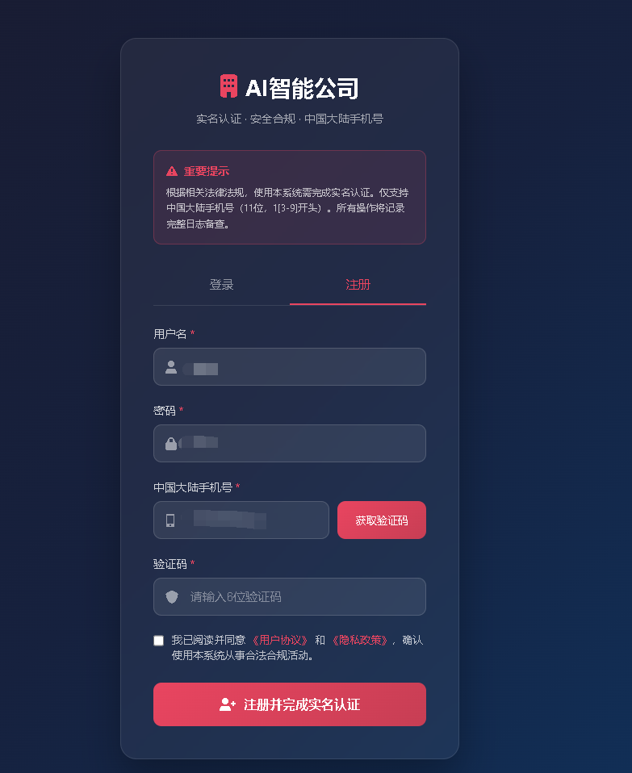
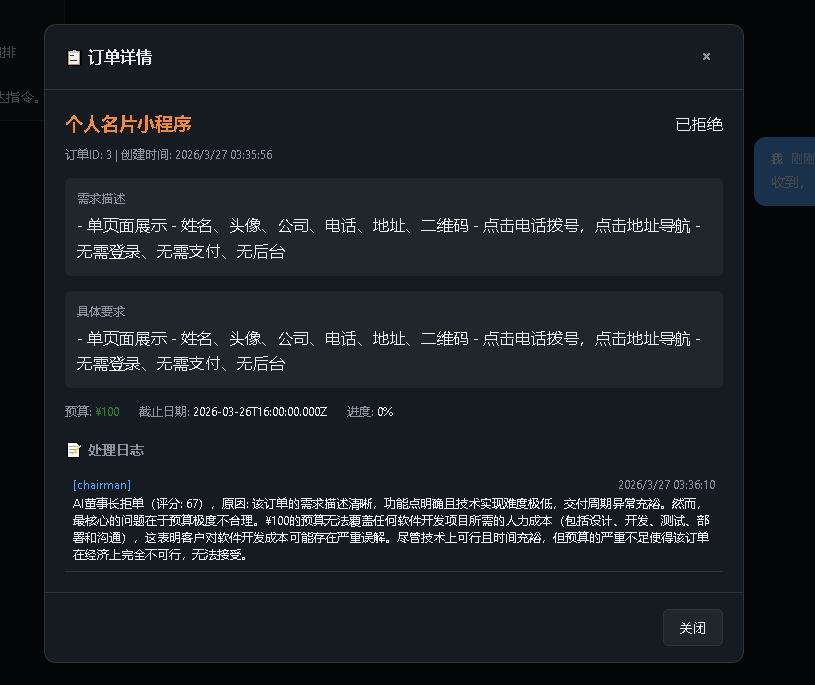
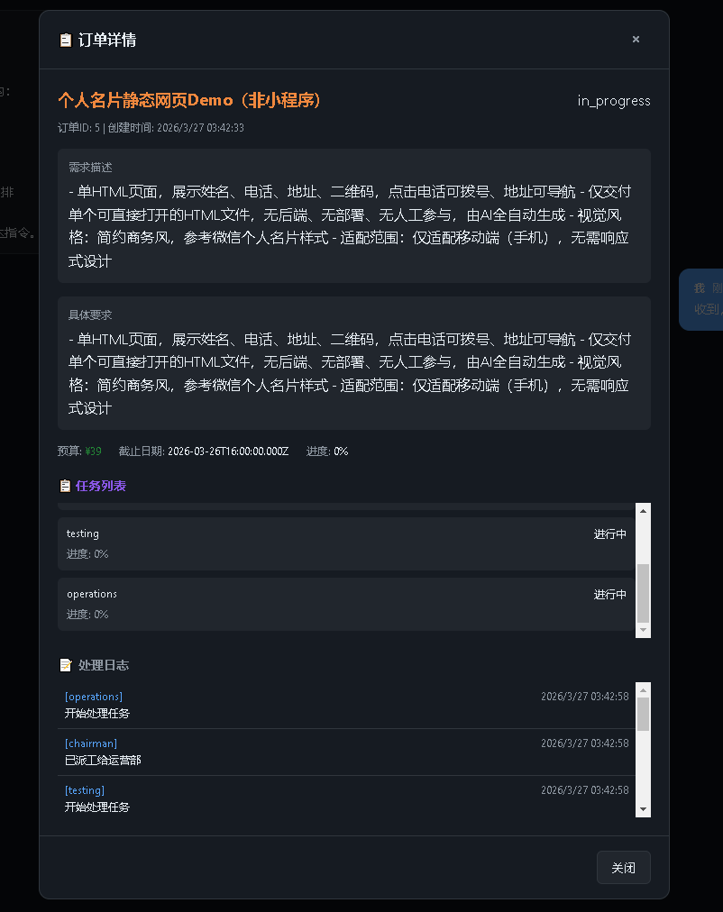
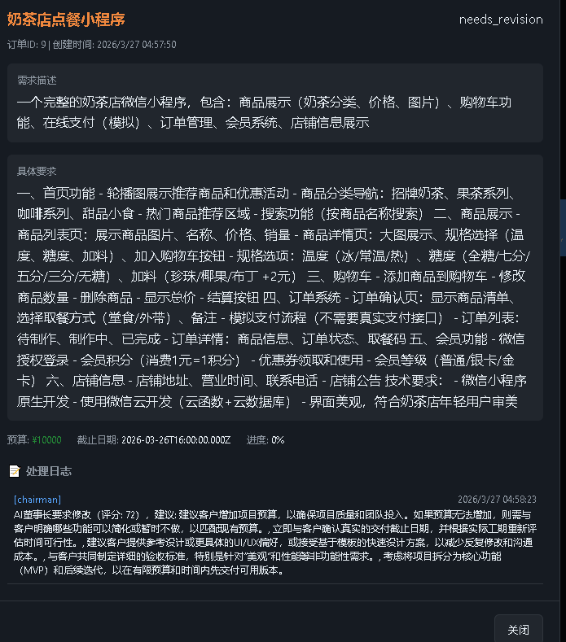
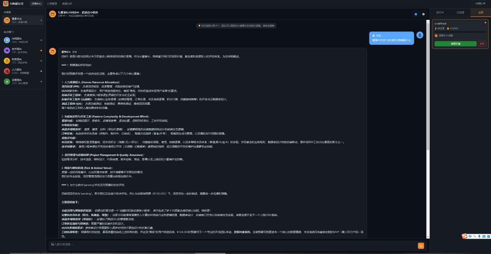
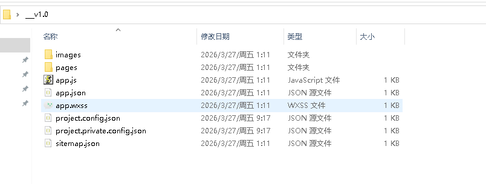
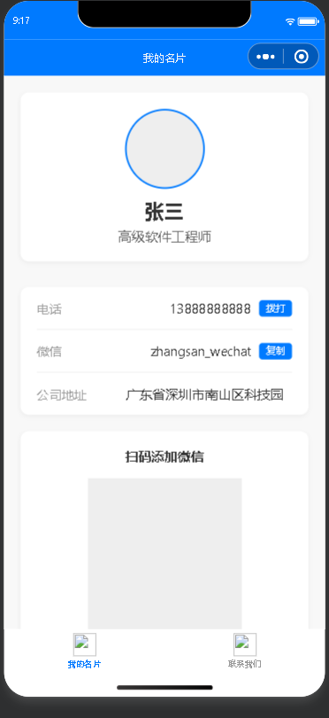

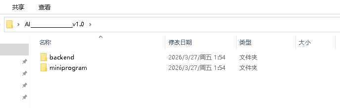
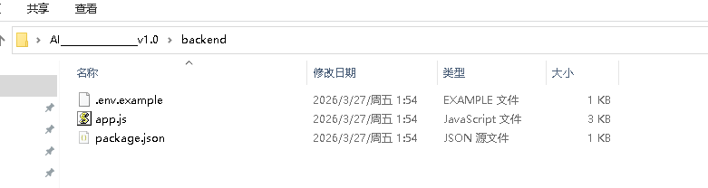
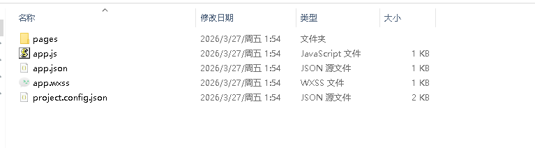
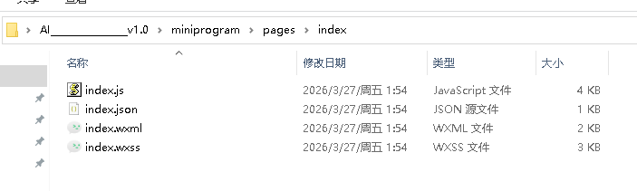
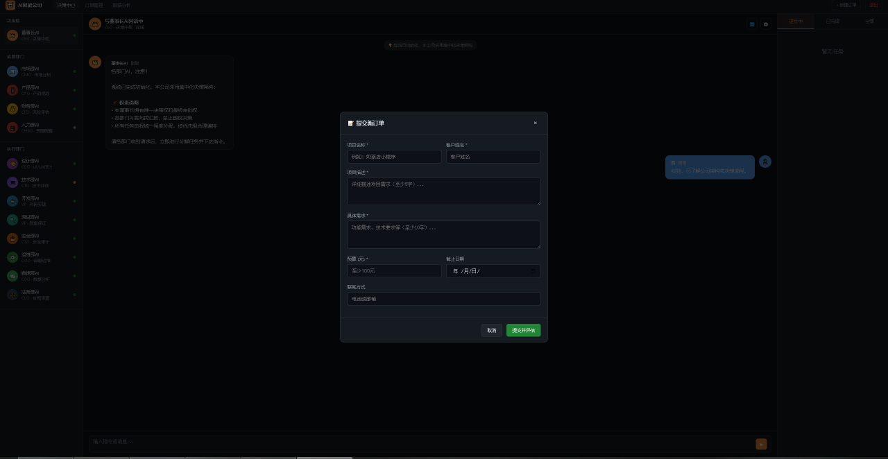
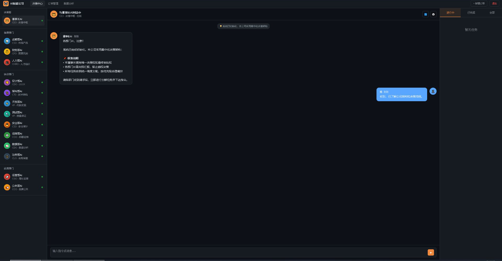

## 💰 Investment Opportunity
- **Pre-seed Funding Target**: $500,000 – $1,000,000
- **Valuation**: $5,000,000 – $10,000,000
- **Use of Funds**: Product iteration, market expansion, team building, global promotion.

## 🛠️ Tech Stack
- Frontend: HTML/CSS/JavaScript, WeChat Mini Program
- Backend: Node.js
- AI Layer: Model-agnostic, supports all major LLMs
- Architecture: Centralized AI Governance + Hierarchical Agent Collaboration

## 📄 License
This project is licensed under the MIT License.

## 📞 Contact
Email: 3239035415@qq.com
